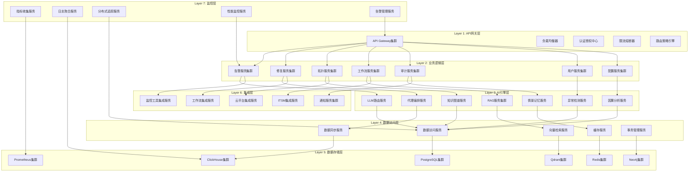

# AIOps Agent 架构图 - 7层分布式架构
 
**设计原则:** 高可用、可扩展、松耦合、智能化

---

## 🏗️ 总体架构概览



---

## 📐 详细架构设计

### Layer 1: API网关层

**功能定位:** 统一入口、流量控制、路由分发、安全防护

#### 核心组件

##### 1.1 API Gateway集群
```yaml
组件名称: API Gateway集群
技术选型: Kong / APISIX / Envoy
部署方式: 集群部署 (3+节点)
核心功能:
  - 统一API入口
  - 协议转换 (HTTP/HTTPS/gRPC/WebSocket)
  - 请求路由和负载均衡
  - API版本管理
  - 请求/响应转换
容错设计:
  - 健康检查
  - 自动故障转移
  - 限流降级
扩展能力:
  - 水平扩展支持
  - 动态配置更新
```

##### 1.2 负载均衡器
```yaml
组件名称: 负载均衡器
技术选型: Nginx / HAProxy / AWS ALB
负载策略:
  - 轮询算法
  - 最少连接数
  - 响应时间权重
  - 一致性哈希
健康检查:
  - 主动健康检查
  - 被动健康检查
  - 故障节点自动剔除
```

##### 1.3 认证授权中心
```yaml
组件名称: 认证授权中心
技术选型: OAuth 2.0 / JWT / ABAC
认证方式:
  - JWT令牌认证
  - OAuth 2.0授权码模式
  - API密钥认证
  - 多因素认证 (MFA)
授权模型:
  - RBAC (基于角色)
  - ABAC (基于属性)
  - 策略引擎集成
会话管理:
  - 分布式会话存储
  - 令牌刷新机制
  - 单点登录 (SSO)
```

##### 1.4 限流熔断器
```yaml
组件名称: 限流熔断器
技术选型: Sentinel / Hystrix / Resilience4j
限流策略:
  - 令牌桶算法
  - 漏桶算法
  - 固定窗口计数
  - 分布式限流
熔断机制:
  - 熔断策略配置
  - 自动恢复机制
  - 降级服务支持
防护功能:
  - 防止雪崩效应
  - 系统过载保护
  - 优先级队列
```

##### 1.5 路由策略引擎
```yaml
组件名称: 路由策略引擎
核心功能:
  - 动态路由配置
  - 灰度发布支持
  - A/B测试路由
  - 地理位置路由
  - 权重路由
策略类型:
  - 基于Header的路由
  - 基于路径的路由
  - 基于内容的路由
  - 基于用户属性的路由
```

#### 层间接口设计

```yaml
向上接口:
  - 对外统一REST API
  - GraphQL查询接口
  - WebSocket实时连接
  - gRPC高性能接口

向下接口:
  - 服务发现调用
  - 负载均衡请求
  - 服务健康检查
  - 配置动态获取

横向接口:
  - 网关集群同步
  - 配置中心集成
  - 监控数据上报
  - 日志集中收集
```

---

### Layer 2: 业务逻辑层

**功能定位:** 核心业务逻辑、领域服务、事务协调

#### 核心组件

##### 2.1 告警服务集群
```yaml
组件名称: 告警服务集群
技术选型: FastAPI + PostgreSQL + Redis
核心功能:
  - 告警采集与标准化
  - 告警去重与聚合
  - 告警关联分析
  - 告警路由分发
  - 告警升级策略
智能特性:
  - 基于ML的告警分类
  - 告警模式识别
  - 噪声抑制算法
  - 告警预测预警
容错设计:
  - 分布式事务
  - 消息队列解耦
  - 事件溯源模式
```

##### 2.2 修复服务集群
```yaml
组件名称: 修复服务集群
技术选型: FastAPI + Workflow Engine
核心功能:
  - 自动修复编排
  - Runbook执行引擎
  - 修复策略管理
  - 修复效果评估
  - 回滚机制
安全特性:
  - 权限检查
  - 操作审计
  - 人工审批流程
  - 风险评估
集成能力:
  - 与AI引擎集成
  - 与工作流引擎集成
  - 与配置管理集成
```

##### 2.3 拓扑服务集群
```yaml
组件名称: 拓扑服务集群
技术选型: FastAPI + Neo4j + Graph Algorithms
核心功能:
  - 服务拓扑发现
  - 依赖关系建模
  - 实时拓扑更新
  - 拓扑可视化
  - 影响范围分析
智能特性:
  - 自动拓扑推断
  - 异常拓扑检测
  - 拓扑变化分析
  - 爆炸半径计算
存储设计:
  - 图数据库存储
  - 拓扑版本管理
  - 增量更新机制
```

##### 2.4 工作流服务集群
```yaml
组件名称: 工作流服务集群
技术选型: Temporal / Airflow / Cadence
核心功能:
  - 工作流编排
  - 任务调度
  - 状态机管理
  - 长时间运行任务
  - 补偿事务
工作流类型:
  - 串行工作流
  - 并行工作流
  - 条件分支工作流
  - 子工作流调用
监控能力:
  - 工作流可视化
  - 执行历史追踪
  - 性能指标收集
```

##### 2.5 审计服务集群
```yaml
组件名称: 审计服务集群
技术选型: FastAPI + ClickHouse + Elasticsearch
核心功能:
  - 操作日志记录
  - 审计事件追踪
  - 合规报告生成
  - 异常行为检测
  - 数据保留策略
合规特性:
  - 不可篡改存储
  - 完整性校验
  - 访问控制
  - 加密存储
查询能力:
  - 实时审计查询
  - 复杂条件检索
  - 统计分析
```

##### 2.6 用户服务集群
```yaml
组件名称: 用户服务集群
技术选型: FastAPI + PostgreSQL + Redis
核心功能:
  - 用户管理
  - 角色权限管理
  - 组织架构管理
  - 用户行为分析
  - 配置偏好管理
安全特性:
  - 密码策略
  - 账户锁定
  - 审计日志
  - 多租户隔离
```

##### 2.7 配置服务集群
```yaml
组件名称: 配置服务集群
技术选型: FastAPI + etcd / Consul
核心功能:
  - 配置集中管理
  - 配置版本控制
  - 动态配置推送
  - 配置变更审计
  - 环境隔离
特性:
  - 配置热更新
  - 灰度配置发布
  - 配置回滚
  - 配置校验
```

#### 层间接口设计

```yaml
向上接口:
  - RESTful API (Layer 1调用)
  - gRPC高性能调用
  - 事件驱动接口
  - 消息队列接口

向下接口:
  - 数据访问接口 (Layer 4)
  - AI能力接口 (Layer 3)
  - 外部集成接口 (Layer 6)

横向接口:
  - 服务间调用
  - 事件发布订阅
  - 分布式事务协调
  - 服务网格通信
```

---

### Layer 3: AI引擎层

**功能定位:** AI能力中心、智能分析、决策支持

#### 核心组件

##### 3.1 LLM路由服务
```yaml
组件名称: LLM路由服务
技术选型: FastAPI + LiteLLM + Cost Optimizer
核心功能:
  - 多模型LLM路由
  - 成本优化策略
  - 负载均衡
  - 失败重试
  - 性能监控
支持模型:
  - OpenAI (GPT-4, GPT-3.5)
  - Anthropic (Claude)
  - 开源模型 (Llama, Mistral)
  - 本地部署模型
路由策略:
  - 基于成本的路由
  - 基于性能的路由
  - 基于任务类型的路由
  - 智能负载均衡
```

##### 3.2 RAG服务集群
```yaml
组件名称: RAG服务集群
技术选型: FastAPI + LangChain + Qdrant
核心功能:
  - 知识库检索
  - 文档向量化
  - 语义搜索
  - 上下文构建
  - 答案生成
检索策略:
  - 混合检索 (BM25 + 语义)
  - 重排序算法
  - 多路召回
  - 查询扩展
知识库类型:
  - 文档知识库
  - 代码知识库
  - 运维知识库
  - 历史案例库
```

##### 3.3 代理编排服务
```yaml
组件名称: 代理编排服务
技术选型: LangGraph + State Machine
核心功能:
  - 多代理协作
  - 任务分解
  - 执行协调
  - 结果聚合
  - 错误处理
代理类型:
  - 监控代理
  - 诊断代理
  - 修复代理
  - 分析代理
  - 报告代理
编排模式:
  - 串行执行
  - 并行执行
  - 条件分支
  - 迭代循环
```

##### 3.4 情景记忆服务
```yaml
组件名称: 情景记忆服务
技术选型: FastAPI + Vector DB + Embedding
核心功能:
  - 事件记忆存储
  - 相似事件检索
  - 经验学习
  - 知识积累
  - 模式识别
记忆类型:
  - 短期记忆 (工作状态)
  - 长期记忆 (历史经验)
  - 语义记忆 (知识图谱)
  - 程序记忆 (操作流程)
检索能力:
  - 向量相似度检索
  - 时间范围检索
  - 上下文检索
  - 多维过滤
```

##### 3.5 知识图谱服务
```yaml
组件名称: 知识图谱服务
技术选型: FastAPI + Neo4j + Graph Algorithms
核心功能:
  - 实体关系建模
  - 图谱构建
  - 图谱查询
  - 图推理
  - 图可视化
图谱类型:
  - 服务依赖图谱
  - 基础设施图谱
  - 业务流程图谱
  - 故障传播图谱
分析能力:
  - 路径分析
  - 社区发现
  - 中心性分析
  - 因果推理
```

##### 3.6 因果分析服务
```yaml
组件名称: 因果分析服务
技术选型: Python + CausalML + DoWhy
核心功能:
  - 因果发现
  - 因果推断
  - 反事实推理
  - 根因定位
  - 效应估计
算法支持:
  - 结构因果模型 (SCM)
  - 因果发现算法 (FCI, PC)
  - 双重机器学习
  - 因果森林
应用场景:
  - 故障根因分析
  - 性能瓶颈定位
  - 变更影响评估
  - 策略效果评估
```

##### 3.7 异常检测服务
```yaml
组件名称: 异常检测服务
技术选型: Python + PyOD + TensorFlow
核心功能:
  - 实时异常检测
  - 异常分类
  - 异常评分
  - 异常解释
  - 基线自适应
检测算法:
  - 统计方法 (3-sigma, IQR)
  - 机器学习 (Isolation Forest, LOF)
  - 深度学习 (Autoencoder, LSTM)
  - 时序方法 (ARIMA, Prophet)
自适应能力:
  - 在线学习
  - 概念漂移检测
  - 季节性调整
  - 多维异常检测
```

#### 层间接口设计

```yaml
向上接口:
  - AI能力API (Layer 2调用)
  - 流式AI接口
  - 批处理AI接口
  - AI模型管理API

向下接口:
  - 数据检索接口 (Layer 4)
  - 向量检索接口
  - 图谱查询接口
  - 外部AI服务调用

横向接口:
  - AI服务间协作
  - 模型服务通信
  - 结果数据共享
  - 性能监控集成
```

---

### Layer 4: 数据访问层

**功能定位:** 数据访问抽象、缓存管理、数据同步

#### 核心组件

##### 4.1 数据访问服务
```yaml
组件名称: 数据访问服务
技术选型: SQLAlchemy 2.0 + AsyncPG
核心功能:
  - ORM数据访问
  - 查询构建
  - 事务管理
  - 连接池管理
  - 慢查询监控
数据库支持:
  - PostgreSQL (主数据库)
  - MySQL (兼容支持)
  - SQLite (开发测试)
访问模式:
  - 读写分离
  - 分库分表
  - 数据库路由
  - 查询优化
```

##### 4.2 缓存服务
```yaml
组件名称: 缓存服务
技术选型: Redis + Memcached
核心功能:
  - 分布式缓存
  - 缓存预热
  - 缓存击穿保护
  - 缓存雪崩防护
  - 缓存监控
缓存策略:
  - Cache-Aside
  - Write-Through
  - Write-Behind
  - Refresh-Ahead
数据类型:
  - 字符串缓存
  - 哈希缓存
  - 列表缓存
  - 集合缓存
  - 有序集合缓存
```

##### 4.3 向量检索服务
```yaml
组件名称: 向量检索服务
技术选型: Qdrant + Weaviate + Milvus
核心功能:
  - 向量存储
  - 相似度搜索
  - 向量索引
  - 向量聚类
  - 向量更新
检索能力:
  - 近似最近邻 (ANN)
  - 精确最近邻
  - 混合检索
  - 多向量检索
索引类型:
  - HNSW索引
  - IVF索引
  - PQ索引
  - 图索引
```

##### 4.4 数据同步服务
```yaml
组件名称: 数据同步服务
技术选型: Debezium + CDC + Kafka
核心功能:
  - 实时数据同步
  - 数据变更捕获
  - 数据转换
  - 数据一致性保证
  - 同步监控
同步模式:
  - 单向同步
  - 双向同步
  - 多源同步
  - 增量同步
一致性保证:
  - 最终一致性
  - 强一致性 (可选)
  - 冲突解决
  - 数据校验
```

##### 4.5 事务管理服务
```yaml
组件名称: 事务管理服务
技术选型: Saga Pattern + 2PC
核心功能:
  - 分布式事务
  - 补偿事务
  - 事务日志
  - 事务恢复
  - 死锁检测
事务模式:
  - Saga模式
  - TCC模式
  - 本地消息表
  - 事务消息
隔离级别:
  - 读未提交
  - 读已提交
  - 可重复读
  - 串行化
```

#### 层间接口设计

```yaml
向上接口:
  - 数据访问API (Layer 2/3调用)
  - 缓存操作API
  - 向量检索API
  - 数据同步API

向下接口:
  - 数据库连接 (Layer 5)
  - 缓存连接
  - 向量数据库连接
  - 消息队列连接

横向接口:
  - 数据访问协调
  - 缓存一致性
  - 数据同步协调
  - 事务协调
```

---

### Layer 5: 数据存储层

**功能定位:** 数据持久化、分布式存储、高性能查询

#### 核心组件

##### 5.1 PostgreSQL集群
```yaml
组件名称: PostgreSQL集群
技术选型: PostgreSQL 15+ + Patroni
部署架构:
  - 主从复制 (1主N从)
  - 故障自动切换
  - 读写分离
  - 分片存储 (可选)
核心功能:
  - 关系数据存储
  - 事务处理
  - 全文搜索
  - JSON文档存储
性能优化:
  - 索引优化
  - 查询优化
  - 连接池配置
  - 内存配置
```

##### 5.2 Redis集群
```yaml
组件名称: Redis集群
技术选型: Redis 7+ + Redis Cluster
部署架构:
  - 集群模式 (16384槽)
  - 主从复制
  - 自动故障转移
  - 数据分片
数据类型:
  - String
  - Hash
  - List
  - Set
  - ZSet
  - Stream
持久化:
  - RDB快照
  - AOF日志
  - 混合持久化
  - 数据备份
```

##### 5.3 Qdrant集群
```yaml
组件名称: Qdrant集群
技术选型: Qdrant + Distributed Mode
部署架构:
  - 分布式集群
  - 数据分片
  - 副本机制
  - 负载均衡
核心功能:
  - 向量存储
  - 相似度搜索
  - 向量索引
  - 过滤查询
索引类型:
  - HNSW
  - Payload索引
  - 过滤索引
性能特性:
  - 高并发检索
  - 实时更新
  - 内存优化
  - 磁盘存储
```

##### 5.4 Prometheus集群
```yaml
组件名称: Prometheus集群
技术选型: Prometheus + Thanos + VictoriaMetrics
部署架构:
  - 联邦集群
  - 长期存储
  - 高可用查询
  - 数据降采样
核心功能:
  - 时序数据存储
  - 指标采集
  - PromQL查询
  - 告警规则
数据保留:
  - 热数据 (内存)
  - 温数据 (SSD)
  - 冷数据 (HDD)
  - 数据压缩
```

##### 5.5 ClickHouse集群
```yaml
组件名称: ClickHouse集群
技术选型: ClickHouse + Replication + Sharding
部署架构:
  - 副本集群
  - 分片集群
  - 高可用写入
  - 分布式查询
核心功能:
  - 列式存储
  - OLAP查询
  - 实时分析
  - 数据压缩
表引擎:
  - MergeTree
  - ReplicatedMergeTree
  - Distributed
  - AggregatingMergeTree
查询优化:
  - 物化视图
  - 投影
  - 预计算
  - 查询缓存
```

##### 5.6 Neo4j集群
```yaml
组件名称: Neo4j集群
技术选型: Neo4j Enterprise + Causal Cluster
部署架构:
  - 因果集群
  - 核心服务器
  - 只读副本
  - 故障恢复
核心功能:
  - 图数据存储
  - Cypher查询
  - 图算法
  - 事务处理
图特性:
  - 节点关系
  - 属性索引
  - 全文索引
  - 空间索引
```

#### 层间接口设计

```yaml
向上接口:
  - 数据库连接 (Layer 4)
  - 数据查询接口
  - 数据写入接口
  - 管理接口

横向接口:
  - 数据同步
  - 备份恢复
  - 集群协调
  - 监控集成
```

---

### Layer 6: 集成层

**功能定位:** 外部系统集成、工具适配、协议转换

#### 核心组件

##### 6.1 监控工具集成服务
```yaml
组件名称: 监控工具集成服务
技术选型: FastAPI + Adapter Pattern
支持的监控工具:
  云监控:
    - AWS CloudWatch
    - Azure Monitor
    - GCP Cloud Monitoring
  APM工具:
    - Datadog
    - New Relic
    - Dynatrace
  开源监控:
    - Prometheus
    - Grafana
    - Zabbix
  日志工具:
    - ELK Stack
    - Splunk
    - Graylog
集成方式:
  - API集成
  - Agent集成
  - 协议适配
  - 数据转换
```

##### 6.2 云平台集成服务
```yaml
组件名称: 云平台集成服务
技术选型: Terraform + Cloud SDK
支持的云平台:
  - AWS (EC2, S3, RDS, Lambda)
  - Azure (VM, Storage, SQL, Functions)
  - GCP (Compute, Storage, Cloud SQL)
  - 阿里云 (ECS, OSS, RDS)
  - 腾讯云 (CVM, COS, TencentDB)
核心功能:
  - 资源发现
  - 指标采集
  - 日志收集
  - 操作执行
安全特性:
  - IAM权限管理
  - 访问控制
  - 审计日志
  - 加密传输
```

##### 6.3 通知服务集群
```yaml
组件名称: 通知服务集群
技术选型: FastAPI + Message Queue
通知渠道:
  即时通讯:
    - Slack
    - Microsoft Teams
    - 钉钉
    - 企业微信
  邮件:
    - SMTP
    - SendGrid
    - 阿里云邮件
  短信:
    - Twilio
    - 阿里云短信
    - 腾讯云短信
  电话:
    - Twilio Voice
    - 阿里云语音
通知策略:
  - 通知路由
  - 通知聚合
  - 通知升级
  - 通知抑制
```

##### 6.4 工作流集成服务
```yaml
组件名称: 工作流集成服务
技术选型: FastAPI + Workflow Engines
支持的工作流:
  - Jenkins
  - GitLab CI
  - GitHub Actions
  - Azure DevOps
  - CircleCI
集成功能:
  - 触发构建
  - 查询状态
  - 获取日志
  - 取消执行
事件驱动:
  - 构建事件
  - 部署事件
  - 回滚事件
  - 自定义事件
```

##### 6.5 ITSM集成服务
```yaml
组件名称: ITSM集成服务
技术选型: FastAPI + ITSM APIs
支持的ITSM:
  - ServiceNow
  - JIRA Service Management
  - BMC Remedy
  - Zendesk
集成功能:
  - 工单创建
  - 工单更新
  - 工单查询
  - CMDB同步
数据映射:
  - 字段映射
  - 状态映射
  - 优先级映射
  - 用户映射
```

#### 层间接口设计

```yaml
向上接口:
  - 集成API (Layer 2调用)
  - 回调接口
  - Webhook接口
  - 事件推送接口

向下接口:
  - 外部系统API
  - 消息队列
  - 数据库连接
  - 文件存储

横向接口:
  - 集成协调
  - 数据转换
  - 错误处理
  - 重试机制
```

---

### Layer 7: 监控层

**功能定位:** 可观测性、性能监控、告警管理

#### 核心组件

##### 7.1 指标收集服务
```yaml
组件名称: 指标收集服务
技术选型: Prometheus + OpenTelemetry
指标类型:
  - Counter (计数器)
  - Gauge (仪表)
  - Histogram (直方图)
  - Summary (摘要)
  - MetricFamily (指标族)
数据来源:
  - 应用指标
  - 系统指标
  - 业务指标
  - 自定义指标
采集方式:
  - Pull模式 (Prometheus)
  - Push模式 (Pushgateway)
  - Agent采集
  - SDK集成
```

##### 7.2 日志聚合服务
```yaml
组件名称: 日志聚合服务
技术选型: ELK Stack + Loki
日志类型:
  - 应用日志
  - 系统日志
  - 审计日志
  - 访问日志
处理流程:
  - 日志采集
  - 日志解析
  - 日志索引
  - 日志存储
  - 日志检索
查询能力:
  - 全文搜索
  - 结构化查询
  - 聚合分析
  - 可视化展示
```

##### 7.3 分布式追踪服务
```yaml
组件名称: 分布式追踪服务
技术选型: Jaeger + Zipkin + OpenTelemetry
追踪数据:
  - Trace (追踪)
  - Span (跨度)
  - Span Context (跨度上下文)
  - Baggage (行李)
追踪能力:
  - 调用链追踪
  - 性能分析
  - 依赖分析
  - 错误追踪
可视化:
  - 调用链图
  - 服务依赖图
  - 性能热力图
  - 时间线视图
```

##### 7.4 性能监控服务
```yaml
组件名称: 性能监控服务
技术选型: APM + Profiling
监控维度:
  - 应用性能
  - 数据库性能
  - 缓存性能
  - 网络性能
监控指标:
  - 响应时间
  - 吞吐量
  - 错误率
  - 资源利用率
分析能力:
  - 性能瓶颈分析
  - 慢查询分析
  - 内存泄漏检测
  - CPU分析
```

##### 7.5 告警管理服务
```yaml
组件名称: 告警管理服务
技术选型: AlertManager + 自研告警引擎
告警规则:
  - 阈值告警
  - 趋势告警
  - 异常检测告警
  - 复合条件告警
告警处理:
  - 告警聚合
  - 告警去重
  - 告警路由
  - 告警升级
通知渠道:
  - 邮件通知
  - 即时通讯
  - 短信通知
  - 电话通知
```

#### 层间接口设计

```yaml
向上接口:
  - 监控API (管理接口)
  - 告警API
  - 查询API
  - 配置API

向下接口:
  - 数据存储 (Layer 5)
  - 消息队列
  - 外部集成 (Layer 6)

横向接口:
  - 数据关联
  - 指标关联
  - 告警关联
  - 可视化集成
```

---

## 🔄 层间功能设计

### 通信机制

```yaml
同步通信:
  - RESTful API (HTTP/HTTPS)
  - gRPC (高性能RPC)
  - GraphQL (查询语言)
  - WebSocket (实时通信)

异步通信:
  - 消息队列 (Kafka/RabbitMQ)
  - 发布订阅 (Redis Pub/Sub)
  - 事件总线 (EventBus)
  - 消息流 (Kafka Streams)

服务发现:
  - 服务注册 (Consul/etcd)
  - 健康检查
  - 负载均衡
  - 故障转移
```

### 数据流设计

```yaml
请求数据流:
  Layer 1 (API Gateway) 
    → Layer 2 (Business Logic)
      → Layer 3 (AI Engine)
        → Layer 4 (Data Access)
          → Layer 5 (Data Storage)

响应数据流:
  Layer 5 (Data Storage)
    → Layer 4 (Data Access)
      → Layer 3 (AI Engine)
        → Layer 2 (Business Logic)
          → Layer 1 (API Gateway)

事件数据流:
  Layer 6 (Integration)
    → Layer 2 (Business Logic)
      → Layer 7 (Monitoring)
        → Layer 5 (Data Storage)
```

### 错误处理设计

```yaml
错误传播:
  - 错误封装
  - 错误转换
  - 错误传播
  - 错误聚合

错误处理:
  - 重试机制
  - 熔断机制
  - 降级机制
  - 补偿机制

错误监控:
  - 错误日志
  - 错误指标
  - 错误告警
  - 错误分析
```

### 安全设计

```yaml
认证授权:
  - 统一认证 (Layer 1)
  - 权限控制 (各层)
  - 审计日志 (Layer 2/7)
  - 数据加密 (Layer 5)

网络安全:
  - TLS加密
  - 网络隔离
  - 访问控制
  - DDoS防护

数据安全:
  - 数据加密
  - 数据脱敏
  - 数据备份
  - 数据恢复
```

---

## 🚀 部署架构

### 部署拓扑

```yaml
生产环境:
  - 多可用区部署
  - 多地域容灾
  - 蓝绿部署
  - 金丝雀发布

容器化:
  - Docker容器化
  - Kubernetes编排
  - Helm Chart管理
  - 服务网格 (Istio/Linkerd)

基础设施:
  - 云原生架构
  - 基础设施即代码
  - 自动化部署
  - 弹性伸缩
```

### 扩展性设计

```yaml
水平扩展:
  - 无状态服务自动扩展
  - 有状态服务分片扩展
  - 数据库读写分离
  - 缓存集群扩展

垂直扩展:
  - 资源配置优化
  - 性能调优
  - 硬件升级
  - 专用硬件加速

弹性伸缩:
  - 自动伸缩策略
  - 预定义伸缩策略
  - 定时伸缩
  - 事件驱动伸缩
```

---

## 📊 技术栈总结

### 核心技术栈

```yaml
API层:
  - Kong/APISIX (API Gateway)
  - Nginx (Load Balancer)
  - OAuth 2.0/JWT (Auth)

业务层:
  - FastAPI (Web Framework)
  - PostgreSQL (Database)
  - Redis (Cache)
  - Temporal (Workflow)

AI层:
  - LangGraph (Agent Orchestration)
  - LiteLLM (LLM Routing)
  - Qdrant (Vector DB)
  - Neo4j (Graph DB)

数据层:
  - SQLAlchemy 2.0 (ORM)
  - AsyncPG (Async Driver)
  - ClickHouse (OLAP)
  - Prometheus (TSDB)

集成层:
  - Terraform (IaC)
  - Cloud SDKs (Multi-cloud)
  - Adapter Pattern (Integration)

监控层:
  - OpenTelemetry (Observability)
  - Prometheus (Metrics)
  - ELK Stack (Logging)
  - Jaeger (Tracing)
```

---

## 🎯 架构优势

### 技术优势

```yaml
高性能:
  - 分布式架构
  - 异步处理
  - 缓存优化
  - 数据库优化

高可用:
  - 集群部署
  - 故障自动转移
  - 多地域容灾
  - 数据备份

可扩展:
  - 水平扩展
  - 垂直扩展
  - 弹性伸缩
  - 模块化设计

可维护:
  - 分层架构
  - 服务解耦
  - 标准化接口
  - 完善监控
```

### 业务优势

```yaml
智能化:
  - AI驱动决策
  - 自动化运维
  - 预测性维护
  - 智能告警

集成化:
  - 统一平台
  - 多工具集成
  - 数据融合
  - 流程编排

企业级:
  - 权限控制
  - 审计合规
  - 多租户支持
  - 高性能保障
```

--- 
**架构状态:** 实施中