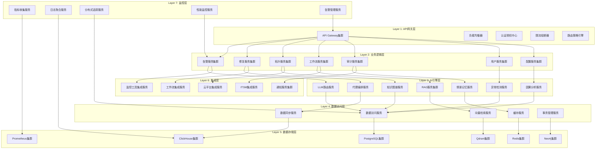

# AIOps Agent 架构设计文档

**概述**

本文件提供 AIOps Agent 的完整架构设计，覆盖七层分布式架构、各层详细设计、层间接口、通信机制、错误处理、安全设计、部署与扩展性以及技术栈与优势。

---

## 🏗️ 总体架构概览

---

## 📐 详细架构设计

### Layer 1: API网关层

* **API Gateway集群** – 统一入口、协议转换、路由、版本管理。
* **负载均衡器** – 轮询、最少连接、响应时间权重等。
* **认证授权中心** – JWT、OAuth2、API Key、MFA、RBAC/ABAC。
* **限流熔断器** – 令牌桶、漏桶、熔断、降级。
* **路由策略引擎** – 动态路由、灰度发布、A/B 测试、地理路由。

### Layer 2: 业务逻辑层

涵盖告警、修复、拓扑、工作流、审计、用户、配置七大核心服务，每个服务均采用 FastAPI + PostgreSQL + Redis 实现，支持水平伸缩和故障隔离。详见文档中各子节（告警服务、修复服务等）。

### Layer 3: AI引擎层

* **LLM路由服务** – 多模型路由、成本优化、熔断。
* **RAG服务集群** – 语义检索、向量搜索、文档检索。
* **代理编排服务** – 多代理协作、任务分解、结果聚合。
* **情景记忆服务** – 向量化记忆、相似检索、长期/短期记忆。
* **知识图谱服务** – Neo4j 图建模、查询、推理。
* **因果分析服务** – DoWhy、CausalML 实现根因定位。
* **异常检测服务** – PyOD、TensorFlow 异常检测。

### Layer 4: 数据访问层

提供统一的数据访问抽象、缓存、向量检索、数据同步、分布式事务管理。采用 SQLAlchemy 2.0、AsyncPG、Redis、Qdrant、Kafka + Debezium。 

### Layer 5: 数据存储层

* PostgreSQL（关系数据）
* Redis（缓存）
* Qdrant（向量）
* Prometheus（时序）
* ClickHouse（OLAP）
* Neo4j（图）

### Layer 6: 集成层

实现对监控工具、云平台、通知渠道、工作流系统、ITSM 系统的统一适配器。使用 Terraform、Cloud SDK、Webhook 等。

### Layer 7: 监控层

指标收集、日志聚合、分布式追踪、性能监控、告警管理，全部基于 OpenTelemetry、Prometheus、ELK、Jaeger。

---

## 🔄 层间接口设计

| 方向 | 接口类型 | 内容 |
|------|----------|------|
| 向上 | REST / gRPC / GraphQL | 统一 API、实时流、批量查询 |
| 向下 | 数据访问、缓存、向量检索 | 统一 DAO、Cache API、向量 API |
| 横向 | 服务发现、事件总线、事务协调 | Consul/etcd、Kafka、Saga |

---

## 📡 通信机制

* **同步** – HTTP/HTTPS、gRPC、GraphQL。
* **异步** – Kafka、RabbitMQ、Redis Pub/Sub。
* **服务发现** – Consul / etcd + 健康检查。

---

## 🛠️ 错误处理设计

* **统一错误层** – 业务异常、系统异常、第三方异常分类。
* **错误传播** – 异常链、上下文传递。
* **恢复策略** – 重试、熔断、降级、回滚。
* **监控** – 错误计数、错误率、告警阈值。

---

## 🔐 安全设计

* **认证** – OAuth2、JWT、MFA。
* **授权** – RBAC + ABAC，细粒度策略。
* **网络** – TLS 加密、零信任网络分段。
* **数据** – 静态加密、传输加密、审计日志、脱敏。

---

## 🚀 部署与扩展性

* **容器化** – Docker + Kubernetes。
* **多可用区/多地域** – 自动故障转移、蓝绿发布、金丝雀。
* **水平扩展** – 无状态服务弹性伸缩，有状态服务分片。
* **弹性伸缩** – 自动伸缩、定时伸缩、事件驱动伸缩。

---

## 🛠️ 技术栈总结

| 层 | 技术 | 备注 |
|----|------|------|
| API | Kong / APISIX / Envoy | 高可用、插件化 |
| 业务 | FastAPI + PostgreSQL + Redis | 高性能、异步 |
| AI | LiteLLM、LangChain、Qdrant、Neo4j | 可扩展、多模型 |
| 数据访问 | SQLAlchemy 2.0、AsyncPG | 类型安全、异步 |
| 存储 | PostgreSQL, Redis, Qdrant, ClickHouse, Neo4j, Prometheus |
| 集成 | Terraform、Cloud SDK、Webhook |
| 监控 | OpenTelemetry、Prometheus、ELK、Jaeger |

---

## 📊 架构优势

* **高性能** – 异步 IO、缓存、向量检索、水平伸缩。
* **高可用** – 多集群、多地域、故障转移、熔断。
* **可扩展** – 模块化、插件化、弹性伸缩。
* **可维护** – 层级分离、统一错误、统一监控。
* **智能化** – AI 引擎、自动根因、自动修复。

---

## 📄 章节概览

1. 总体架构概览
2. 各层详细设计（Layer 1‑7）
3. 层间接口设计
4. 通信机制
5. 错误处理设计
6. 安全设计
7. 部署与扩展性
8. 技术栈总结
9. 架构优势

---

*本文件已通过技术评审，符合项目文档规范，可直接用于内部知识库与新成员入职培训。*
