# AIOps Agent — 完整目标 7 层架构图

> **目标状态**：功能 100% 实现、227 项任务全部完成、测试通过率 100%（`pytest` 收集 3000+ 用例，覆盖率 ≥ 80%）、所有质量门禁（black/isort/mypy/flake8/bandit/safety）通过。
> **架构模式**：7 层分布式微服务架构 + 横向切面中间件 + 服务网格。

---

## 总体架构图

```mermaid
graph TB
    subgraph L0["表现层 / 客户端"]
        FE["Next.js 前端<br/>frontend/app/ + components/"]
        SDK["SDK / API Clients"]
        CLI["CLI / curl / Webhook"]
    end

    subgraph L1["Layer 1: API 网关层"]
        AG["API Gateway 集群<br/>(Kong / APISIX / Envoy)"]
        LB["负载均衡器<br/>(Nginx / HAProxy / ALB)"]
        AUTH["认证授权中心<br/>(OAuth2 / JWT / MFA / RBAC / ABAC)"]
        RL["限流熔断器<br/>(Rate Limiter / Circuit Breaker)"]
        RSE["路由策略引擎<br/>(灰度 / A-B / 地理位置路由)"]
        SEC["安全网关<br/>(WAF / DDoS / Input Validation)"]
    end

    subgraph L2["Layer 2: 业务逻辑层"]
        ALERT["告警服务集群"]
        REPAIR["修复服务集群"]
        TOPO["拓扑服务集群"]
        WF["工作流服务集群"]
        AUDIT["审计/合规服务集群"]
        USER["用户/租户服务集群"]
        CFG["配置/平台服务集群"]
        DASH["仪表盘/指标服务集群"]
        PLUGIN["插件生态服务"]
        INTG["集成/ITSM/通知服务"]
        DOC["文档/生成服务"]
        TEST["测试/质量服务"]
    end

    subgraph L3["Layer 3: AI 引擎层"]
        LLM["LLM 路由服务"]
        RAG["RAG 服务集群"]
        AGENT["代理编排服务<br/>(LangGraph + Agent)"]
        MEM["情景记忆服务"]
        KG["知识图谱服务"]
        CAUSAL["因果分析服务"]
        ANOMALY["异常检测服务"]
        ROOT["根因智能分析"]
    end

    subgraph L4["Layer 4: 数据访问与处理层"]
        DAO["数据访问服务<br/>(ORM / DAO / 事务)"]
        CACHE["缓存服务<br/>(Redis / Cache Strategy)"]
        VEC["向量检索服务<br/>(Qdrant)"]
        SYNC["数据同步 / CDC<br/>(Kafka / Debezium)"]
        TX["分布式事务管理<br/>(Saga / TCC)"]
        STREAM["流处理<br/>(Flink / Kafka Streams)"]
    end

    subgraph L5["Layer 5: 数据存储层"]
        PG["PostgreSQL 集群"]
        RD["Redis 集群"]
        QD["Qdrant 向量集群"]
        PM["Prometheus / Thanos / VictoriaMetrics"]
        CH["ClickHouse OLAP 集群"]
        NEO["Neo4j 图数据库"]
        ES["Elasticsearch / Logs"]
        S3["对象存储 / S3 / MinIO"]
    end

    subgraph L6["Layer 6: 集成层"]
        MON["监控工具集成<br/>(Prometheus / Datadog / CloudWatch)"]
        CLOUD["云平台集成<br/>(AWS / Azure / GCP / 阿里云 / 腾讯云)"]
        NOTIFY["通知服务集群<br/>(Slack / Teams / 钉钉 / 邮件 / 短信)"]
        CICD["CI/CD 集成<br/>(Jenkins / GitLab CI / GitHub Actions)"]
        ITSM["ITSM 集成<br/>(ServiceNow / Jira / BMC / Zendesk)"]
        AGENT_OS["Agent/采集器<br/>(Linux / Windows / macOS / Docker / K8s)"]
    end

    subgraph L7["Layer 7: 可观测性监控层"]
        METRICS["指标收集服务"]
        LOGS["日志聚合服务"]
        TRACE["分布式追踪服务"]
        APM["性能监控/APM"]
        ALERT_MGR["告警管理服务"]
        AUDIT_LOG["审计/安全监控"]
    end

    FE --> AG
    SDK --> AG
    CLI --> AG

    AG --> ALERT
    AG --> REPAIR
    AG --> TOPO
    AG --> WF
    AG --> AUDIT
    AG --> USER
    AG --> CFG
    AG --> DASH
    AG --> PLUGIN
    AG --> INTG
    AG --> DOC
    AG --> TEST

    ALERT --> LLM
    REPAIR --> AGENT
    TOPO --> KG
    WF --> RAG
    AUDIT --> MEM
    DASH --> ANOMALY
    CFG --> CAUSAL

    LLM --> DAO
    RAG --> VEC
    AGENT --> SYNC
    MEM --> CACHE
    KG --> DAO
    CAUSAL --> DAO
    ANOMALY --> DAO
    ROOT --> KG

    DAO --> PG
    CACHE --> RD
    VEC --> QD
    SYNC --> CH
    TX --> NEO

    ALERT --> MON
    REPAIR --> CICD
    TOPO --> CLOUD
    WF --> ITSM
    AUDIT --> NOTIFY
    INTG --> AGENT_OS

    METRICS --> PM
    LOGS --> ES
    TRACE --> DAO
    APM --> ALERT
    ALERT_MGR --> AG
    AUDIT_LOG --> AUDIT

```



---

## Layer 1: API 网关层

| 模块 | 对应代码/配置 | 核心能力 | 关键技术 |
| --- | --- | --- | --- |
| API Gateway | `api/__init__.py`, `main.py` + Kong/APISIX/Envoy | 统一入口、协议转换、路由、版本管理 | Kong, APISIX, Envoy |
| 负载均衡 | `infrastructure/gateway/`, Nginx | 轮询、最少连接、权重、健康检查 | Nginx, HAProxy, ALB |
| 认证授权 | `core/authentication.py`, `core/sso_auth.py`, `core/mfa_service.py`, `core/rbac.py`, `core/abac.py`, `core/fine_rbac.py`, `core/unified_access_control.py`, `api/guard_router.py` | JWT/OAuth2/MFA/RBAC/ABAC | OAuth2, JWT, Keycloak |
| 限流熔断 | `core/rate_limiter.py`, `core/rate_limiting.py`, `core/circuit_breaker.py` | 令牌桶、漏桶、熔断、降级 | Sentinel, Resilience4j |
| 路由策略 | `core/service_discovery_manager.py`, `api/*` 路由注册 | 动态路由、灰度、A/B、地理 | Consul, etcd |
| 安全网关 | `core/security_input_validator.py`, `core/security_middleware.py`, `api/guard_router.py` | WAF、DDoS、SQL/XSS/SSRF 校验 | 自定义 + OWASP |
| 协议适配 | `api/websocket_router.py`, `api/sse_router.py`, `api/graphql_router.py`, `api/grpc_router.py`, `api/grpc_service_router.py`, `api/mcp_router.py` | REST/GraphQL/gRPC/WebSocket/SSE/MCP | FastAPI, gRPC, GraphQL, MCP |

---

## Layer 2: 业务逻辑层（FastAPI 微服务集群）

### 2.1 告警服务

| 模块 | 对应代码 | 能力 |
| --- | --- | --- |
| 告警路由 | `api/alert_router.py`, `api/metrics_router.py` | 告警采集、查询、处理、统计 |
| 告警引擎 | `core/alert_engine.py`, `core/alert_intelligence.py`, `core/alert_rules.py`, `core/intelligent_alert_analyzer.py` | 告警聚合、去重、路由、分类、噪声抑制、模式识别 |
| 异常分析 | `core/anomaly_detection.py`, `modules/analyze/anomaly/` | 基于 ML/统计的异常检测 |

### 2.2 自动修复服务

| 模块 | 对应代码 | 能力 |
| --- | --- | --- |
| 修复路由 | `api/autoheal_router.py`, `api/repair_router.py`, `api/unified_repair_router.py`, `api/repair_scripts_router.py`, `api/windows_repair_router.py` | 修复执行、查询、历史、策略 |
| 修复引擎 | `core/repair_engine.py`, `core/auto_heal.py`, `core/runbook_generator.py`, `core/verifier.py` | 自动修复编排、Runbook、回滚、验证 |
| 平台修复 | `core/linux_collector.py`, `core/linux_repair.py`, `core/windows_collector.py`, `core/windows_repair.py`, `core/macos_collector.py`, `core/macos_repair.py`, `core/docker_collector.py`, `core/docker_repair.py`, `core/k8s_collector.py`, `core/k8s_repair.py`, `api/linux_router.py`, `api/docker_router.py`, `api/k8s_router.py` | OS/容器/K8s 修复 |

### 2.3 拓扑服务

| 模块 | 对应代码 | 能力 |
| --- | --- | --- |
| 拓扑路由 | `api/topology_router.py`, `api/topology_view_router.py`, `api/service_discovery_router.py`, `api/service_mesh_router.py` | 拓扑发现、服务图、依赖分析 |
| 拓扑引擎 | `core/topology_engine.py`, `core/heal_graph.py`, `core/event_correlation/` | 服务拓扑、影响范围、图遍历、实时更新 |

### 2.4 工作流与 HITL

| 模块 | 对应代码 | 能力 |
| --- | --- | --- |
| 工作流路由 | `api/workflow_router.py`, `api/workflow_visualization_router.py`, `api/hitl_router.py`, `api/hitl_approval_router.py` | 工作流编排、审批 |
| 工作流引擎 | `core/workflow_engine.py`, `core/workflow/*`, `core/task_scheduler.py`, `core/hitl/*` | 状态机、DAG、DSL、任务调度、人工审批 |

### 2.5 审计与合规

| 模块 | 对应代码 | 能力 |
| --- | --- | --- |
| 审计路由 | `api/audit_router.py`, `api/audit_center_router.py` | 审计日志、查询、报告 |
| 审计引擎 | `core/audit_service.py`, `core/audit_logger.py`, `core/audit_integration_manager.py`, `core/security_audit_system.py`, `core/external_api_audit.py` | 操作审计、合规、完整性校验 |
| 合规 | `core/compliance.py`, `core/compliance_manager.py`, `modules/compliance/` | GDPR/SOC2 合规 |

### 2.6 用户、租户与权限

| 模块 | 对应代码 | 能力 |
| --- | --- | --- |
| 用户路由 | `api/user_router.py` | 用户管理、角色权限 |
| 用户服务 | `core/user_service.py`, `core/authentication.py`, `core/sso_auth.py`, `core/mfa_service.py` | 认证、单点登录、MFA |
| 访问控制 | `core/rbac.py`, `core/abac.py`, `core/fine_rbac.py`, `core/unified_access_control.py`, `core/multi_tenant.py` | RBAC/ABAC/多租户 |
| 国际化 | `core/i18n.py`, `core/i18n_manager.py`, `api/i18n_router.py`, `core/localization_adapter.py`, `core/localization_resource_manager.py` | 多语言、本地化 |

### 2.7 配置与平台管理

| 模块 | 对应代码 | 能力 |
| --- | --- | --- |
| 配置服务 | `core/config_service.py`, `core/config_center.py`, `core/config_validation.py`, `core/unified_config.py`, `core/environment_config.py` | 配置集中管理、热更新、环境隔离、加密 |
| 插件生态 | `api/plugin_router.py`, `api/plugin_development_router.py`, `api/plugin_ecosystem_router.py`, `api/plugin_marketplace_router.py`, `api/plugin_sdk_router.py`, `core/plugin_*` | 插件开发、市场、生态管理 |
| 平台 | `api/infrastructure_router.py`, `api/batch_router.py`, `api/backup_router.py`, `api/chaos_router.py` | 基础设施、批量、备份、混沌工程 |

### 2.8 仪表盘、成本与指标

| 模块 | 对应代码 | 能力 |
| --- | --- | --- |
| 仪表盘 | `api/dashboard_router.py`, `api/cost_router.py`, `api/stats_router.py`, `api/system_resource_router.py` | 仪表盘、成本、系统资源 |
| 指标引擎 | `core/stats_engine.py`, `core/business_metrics.py`, `core/cost_monitor.py`, `core/metrics_converter.py`, `core/metrics_history.py` | 指标计算、成本监控、历史分析 |

### 2.9 文档、测试与集成

| 模块 | 对应代码 | 能力 |
| --- | --- | --- |
| 文档 | `api/documentation_router.py`, `api/doc_generator_router.py`, `core/documentation_generator.py`, `core/documentation_manager.py` | 文档生成、API 文档 |
| 测试 | `api/test_automation_router.py`, `api/test_coverage_router.py`, `api/test_framework_router.py`, `core/test_automation_manager.py`, `core/test_coverage_manager.py`, `core/test_framework_manager.py` | 测试管理、覆盖率、框架 |
| 集成 | `api/integration_router.py`, `api/itsm_router.py`, `api/slack_router.py`, `api/notify_router.py`, `api/cloud_router.py`, `api/mcp_router.py`, `core/integration_ecosystem.py`, `core/integration_manager.py`, `core/third_party_service_integrator.py` | 第三方、ITSM、通知、云平台集成 |

### 2.10 安全与访问

| 模块 | 对应代码 | 能力 |
| --- | --- | --- |
| 安全 | `api/guard_router.py`, `core/security_input_validator.py`, `core/security_middleware.py`, `core/security_system_integrator.py`, `core/vulnerability_manager.py`, `core/key_management_service.py` | 输入校验、安全中间件、密钥管理 |

---

## Layer 3: AI 引擎层

| 模块 | 对应代码 | 核心能力 | 技术 |
| --- | --- | --- | --- |
| LLM 路由 | `core/ai/llm_router/`, `core/ai_engine.py`, `api/ai_router.py`, `api/advanced_ai_router.py` | 多模型路由、成本优化、负载均衡、失败重试 | LiteLLM, OpenAI, Anthropic |
| RAG | `core/ai/rag/`, `core/rag_engine.py`, `api/rag_router.py`, `api/rag_history_router.py`, `api/qdrant_router.py` | 文档向量化、语义检索、混合检索、重排序 | LangChain, Qdrant |
| 代理编排 | `core/ai/langgraph/`, `core/agent/`, `api/ai_router.py`, `api/ai_feedback_router.py` | 多代理协作、任务分解、状态机、结果聚合 | LangGraph, ReAct |
| 情景记忆 | `core/ai/rag/knowledge_base.py`, `core/ai/rag/retriever.py` | 短期/长期记忆、相似检索、经验学习 | 向量数据库 + Embedding |
| 知识图谱 | `core/heal_graph.py`, `core/causal/graph.py`, `core/analysis/l2/` | 实体关系建模、图查询、图推理、拓扑 | Neo4j, Cypher |
| 因果分析 | `core/causal/`, `core/analysis/l2/enhanced_causal_analyzer.py`, `core/enhanced_root_cause_analyzer.py`, `core/root_cause_intelligence.py`, `api/root_cause_router.py` | 因果发现、推断、根因定位、反事实 | DoWhy, CausalML |
| 异常检测 | `core/anomaly_detection.py`, `core/ai_engine.py`, `modules/analyze/anomaly/` | 实时异常、分类、评分、基线自适应 | PyOD, TensorFlow, Prophet |
| 智能告警 | `core/intelligent_alert_analyzer.py` | 告警模式识别、智能降噪 | ML |
| 模型微调 | `core/model_fine_tuner.py` | 领域模型微调 | Fine-tuning |
| 增强 AI | `core/enhanced_ai_capabilities.py`, `core/advanced_ai_capabilities.py` | 高级 AI 能力、AIOps 智能 | LLM + RAG |

---

## Layer 4: 数据访问与处理层

| 模块 | 对应代码 | 核心能力 | 技术 |
| --- | --- | --- | --- |
| 数据访问 | `core/database.py`, `core/db_engine.py`, `core/models.py`, `core/repositories/` | ORM、查询构建、事务、连接池 | SQLAlchemy 2.0, AsyncPG |
| 查询优化 | `core/query_optimization.py`, `core/db_query_optimization.py`, `core/database_query_optimizer.py`, `core/db_read_write_router.py` | 慢查询优化、读写分离、路由 | PostgreSQL |
| 缓存 | `core/cache_helpers.py`, `core/caching_strategy.py`, `core/enhanced_caching.py`, `core/smart_cache_strategy.py`, `core/redis_cluster.py` | 分布式缓存、缓存策略、击穿/雪崩防护 | Redis |
| 向量检索 | `core/qdrant_service.py`, `core/vector_pipeline.py`, `core/ai/rag/vectorizer.py`, `core/ai/rag/retriever.py` | 向量存储、ANN、混合检索 | Qdrant |
| 数据同步 | `core/dual_write.py`, `core/data_integration_manager.py`, `core/data_lifecycle_manager.py`, `core/flink_stream_processor.py`, `core/kafka_stream_processor.py` | CDC、数据同步、流处理 | Kafka, Debezium, Flink |
| 事务管理 | `core/data_consistency.py`, `modules/execute/saga/`, `core/disaster_recovery_drill.py` | 分布式事务、Saga、TCC、补偿 | Saga Pattern |
| 采集 | `core/collector.py`, `core/log_collector.py`, `core/monitoring_infrastructure.py`, `core/collection/l1/otel_collector.py`, `modules/observability/auto_discovery.py` | 指标/日志/链路采集、自动发现 | OpenTelemetry, Agent |

---

## Layer 5: 数据存储层

| 存储 | 对应配置/代码 | 用途 | 部署 |
| --- | --- | --- | --- |
| PostgreSQL | `postgres/`, `data/`, `alembic/`, `core/models.py` | 关系数据、事务、配置、审计 | 主从/集群 |
| Redis | `core/redis_cluster.py`, `core/redis_cluster_mock.py` | 缓存、会话、锁、消息队列 | Cluster |
| Qdrant | `core/qdrant_service.py`, `api/qdrant_router.py` | 向量存储、语义检索 | 分布式集群 |
| Prometheus / Thanos / VictoriaMetrics | `prometheus/`, `victoria-config/`, `core/storage/l4/victoriametrics.py` | 时序指标、告警规则 | 联邦集群 |
| ClickHouse | `modules/storage/clickhouse/`, `core/storage/l4/storage_manager.py` | OLAP、日志/指标分析 | 副本/分片 |
| Neo4j | `core/causal/graph.py`, `core/heal_graph.py` | 图数据、依赖关系、拓扑 | 因果集群 |
| Elasticsearch | `infrastructure/elasticsearch/`, `infrastructure/logging/elasticsearch/`, `core/es_logger.py` | 日志/审计索引、全文检索 | 集群 |
| Loki / Tempo | `infrastructure/loki-config/`, `tempo-config/`, `core/storage/l4/loki.py`, `core/storage/l4/tempo.py` | 日志/链路存储 | 后端存储 |
| 对象存储 | `core/backup.py`, `core/backup_manager.py` | 备份、快照、对象 | S3 / MinIO |

---

## Layer 6: 集成层

| 集成域 | 对应代码/路由 | 支持系统 | 能力 |
| --- | --- | --- | --- |
| 监控工具 | `api/service_monitoring_router.py`, `api/metrics_router.py`, `api/apm_router.py`, `api/tracing_router.py`, `core/monitoring_system_integrator.py` | Prometheus, Datadog, New Relic, Zabbix, CloudWatch | 指标、APM、告警接入 |
| 云平台 | `api/cloud_router.py`, `core/cloud_collector.py`, `core/cloud_collectors/azure.py`, `core/cloud_collectors/gcp.py` | AWS, Azure, GCP, 阿里云, 腾讯云 | 资源发现、指标采集、操作 |
| 操作系统/容器 | `api/linux_router.py`, `api/macos_router.py`, `api/windows_repair_router.py`, `api/docker_router.py`, `api/k8s_router.py` + 对应 `core/*_collector`/`core/*_repair` | Linux, Windows, macOS, Docker, Kubernetes | 采集、修复、命令 |
| 通知 | `api/notify_router.py`, `api/slack_router.py`, `core/notify_engine.py`, `core/slack_adapter.py` | Slack, Teams, 钉钉, 企业微信, 邮件, 短信 | 路由、聚合、升级 |
| ITSM | `api/itsm_router.py`, `core/integration/itsm*` | ServiceNow, Jira, BMC, Zendesk | 工单、CMDB 同步 |
| CI/CD | `api/integration_router.py`, `core/cicd_integration_manager.py`, `core/cicd_pipeline_manager.py`, `core/gitops_manager.py`, `core/kubernetes_deployment_manager.py` | Jenkins, GitLab CI, GitHub Actions, Azure DevOps | 触发、查询、部署 |
| 第三方/通用 | `core/third_party_service_integrator.py`, `core/integration_ecosystem.py`, `core/integration_monitoring_system.py`, `core/interface/*` | Webhook, gRPC, GraphQL, MCP | 通用适配器、协议转换 |

---

## Layer 7: 可观测性监控层

| 模块 | 对应代码/配置 | 能力 |
| --- | --- | --- |
| 指标 | `core/prometheus_metrics.py`, `core/metrics_converter.py`, `core/metrics_history.py`, `api/metrics_router.py`, `api/api_performance_router.py`, `prometheus/`, `grafana/` | 指标采集、PromQL、Grafana 可视化 |
| 日志 | `core/structured_logging.py`, `core/log_router.py`, `core/log_collector.py`, `core/loki_sink.py`, `core/logging/*`, `api/log_router.py`, `infrastructure/logging/` | 结构化日志、分级、过滤、聚合、ELK/Loki |
| 链路追踪 | `core/opentelemetry_tracing.py`, `core/otel_exporter.py`, `core/cross_service_tracing.py`, `core/tracing_visualization.py`, `api/tracing_router.py`, `infrastructure/otel_collector/` | Trace/Span、调用链、依赖分析 |
| APM/性能 | `core/api_performance_optimizer.py`, `core/api_resource_optimizer.py`, `core/api_response_time_optimizer.py`, `core/api_throughput_optimizer.py`, `core/performance_optimizer.py`, `core/performance_*`, `api/apm_router.py` | 响应时间、吞吐量、资源、回归检测 |
| 告警管理 | `alertmanager/alertmanager.yml`, `alerts/`, `prometheus/alerts/`, `modules/observability/smart_alerting.py` | 告警规则、聚合、路由、升级 |
| 安全审计 | `core/security_audit_system.py`, `audit_logs/`, `security_reports/` | 安全事件、审计、合规 |
| 健康检查 | `api/health_router.py`, `core/health_check.py`, `core/heartbeat.py`, `core/module_health_check.py` | 健康探测、就绪/存活检查 |

---

## 横向切面中间件（Cross-Cutting Middleware）

| 中间件 | 对应代码 | 职责 | 所在层 |
| --- | --- | --- | --- |
| 安全中间件 | `core/security_middleware.py`, `core/security_input_validator.py`, `core/input_validator.py`, `core/command_guard.py` | 请求校验、命令保护、XSS/SQL/SSRF 防护 | L1/L2 |
| 认证/授权 | `core/authentication.py`, `core/auth_interface.py`, `core/sso_auth.py`, `core/mfa_service.py`, `core/rbac.py`, `core/abac.py`, `core/fine_rbac.py`, `core/unified_access_control.py` | 用户认证、权限校验、多租户 | L1/L2 |
| 限流/熔断/重试 | `core/rate_limiter.py`, `core/rate_limiting.py`, `core/circuit_breaker.py`, `core/retry_enhanced.py` | 流量控制、故障恢复 | L1/L2/L4 |
| 错误处理 | `core/error_handler.py`, `core/error_handling.py`, `core/error_handling_logging.py`, `core/exception_handler.py`, `core/error_recovery.py`, `core/error_codes/`, `core/exceptions/` | 统一异常、错误码、恢复策略 | L2/L7 |
| 日志 | `core/structured_logging.py`, `core/es_logger.py`, `core/logging/context/`, `core/logging/level/`, `core/logging/analysis/` | 结构化日志、上下文、追踪、分级 | 全层 |
| 链路追踪 | `core/opentelemetry_tracing.py`, `core/otel_exporter.py`, `core/cross_service_tracing.py`, `core/request_tracking.py` | Trace/Span 注入、传播、可视化 | 全层 |
| API 响应标准化 | `core/api_response.py`, `core/api_response_standard.py`, `core/api_response_middleware.py`, `core/api_helpers.py`, `core/api_error.py` | 统一响应格式、错误码 | L1/L2 |
| 幂等 | `core/idempotent.py` | 请求幂等控制 | L1/L2 |
| 多租户 | `core/multi_tenant.py` | 租户隔离 | L2 |
| 国际化 | `core/i18n.py`, `core/i18n_manager.py`, `core/localization_adapter.py` | 多语言、本地化 | L2 |
| 配置/热更新 | `core/config_service.py`, `core/config_center.py`, `core/config_validation.py`, `core/unified_config.py`, `core/environment_config.py` | 配置管理、环境隔离、热更新 | 全层 |
| 依赖注入 | `core/dependency_injection.py` | 服务容器、依赖管理 | 全层 |
| 特性开关 | `core/feature_flag.py` | 功能灰度 | L2/L3 |
| 数据隐私/加密 | `core/data_privacy.py`, `core/key_management_service.py`, `core/security_config.py` | 敏感数据脱敏、加密 | L4/L5 |

---

## 数据流

### 请求-响应流

```text
L1 API Gateway → L2 业务服务 → L3 AI 引擎 → L4 数据访问 → L5 数据存储
             ←              ←              ←              ←

```

### 事件/采集流

```text
L6 集成层/Agent 采集 → L2 业务服务 → L7 监控层 → L5 数据存储

```

### 异步/流式流

```text
L6 外部系统 → Kafka/Debezium → L4 流处理 → L5 ClickHouse/ES

```

---

## 测试与质量门禁（100% 通过状态）

| 门类 | 内容 | 目标 |
| --- | --- | --- |
| 测试框架 | `tests/`: 单元测试、API 测试、集成测试、E2E 测试、性能测试、安全测试 | 3000+ 用例，100% 通过 |
| 覆盖率 | `pytest-cov` + `coverage.xml`/`htmlcov` | 整体 ≥ 80%，核心 ≥ 80% |
| 代码质量 | `black`, `isort`, `mypy`, `flake8` | 0 错误 |
| 安全 | `bandit`, `safety`, `pydocstyle` | 无高危漏洞 |
| CI/CD | `.github/workflows/`, `.pre-commit-config.yaml` | 自动触发、质量门禁 |
| 性能 | `tests/performance/`, Locust | P95 < 100ms，QPS > 1000 |

---

## 部署与基础设施

- **容器化**：`Dockerfile`, `docker-compose.yml`, `docker-compose.{database,monitoring,prod}.yml`
- **K8s/Helm**：`helm/aiops-agent/`
- **IaC**：`terraform/`
- **网关/代理**：`infrastructure/gateway/`, `pgpool/`
- **可观测性**：`prometheus/`, `grafana/`, `alertmanager/`, `loki-config/`, `tempo-config/`, `victoria-config/`, `otel-collector-config.yaml`
- **数据库**：`postgres/`, `alembic/`
- **前端**：`frontend/` (Next.js + Tailwind + shadcn/ui)

---

## 架构优势

- **高可用**：多可用区、多副本、故障自动转移、熔断降级。
- **高性能**：异步 IO、Redis 缓存、向量检索、读写分离、OLAP 加速。
- **可扩展**：水平扩展、无状态服务、插件化、服务网格。
- **可观测**：统一 Trace/Log/Metrics、OpenTelemetry、Grafana、ELK/Loki。
- **智能化**：LLM 路由、RAG、Agent 编排、因果分析、异常检测、自动修复。
- **安全合规**：统一认证授权、审计、数据加密、合规（GDPR/SOC2）。

---

*文件生成时间：2026-07-10*  
*依据：docs/document/task_list.md、docs/document/target_architecture_diagram.md、api/、core/、modules/、frontend/、infrastructure/ 等实际代码结构*
