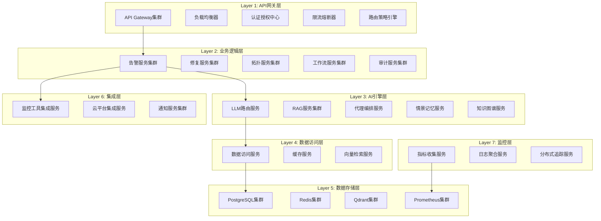

# AIOps Agent - 智能运维平台

<div align="center">


**新一代开源 AIOps Agent**

[文档](https://docs.aiops-agent.com) | [演示](https://demo.aiops-agent.com) | [社区](https://community.aiops-agent.com) | [路线图](https://roadmap.aiops-agent.com)

</div>

---

## 🎯 项目愿景

AIOps Agent 致力于成为**新一代开源 AIOps Agent**，提供企业级的智能运维解决方案。重新定义AIOps行业的技术标准。

### 核心目标

- **技术水平:** 持续迭代中，基于真实源码演进
- **市场定位:** 面向中小规模的开源 AIOps 自愈 Agent
- **核心策略:** 单体 + 可选远程微服务架构，优先把核心告警→自愈闭环跑通
- **开发模式:** AI+专家混合开发
- **差异化:** 开源+企业双模式，成本+技术双重优势

---

## ✨ 核心特性

### 🧠 智能化能力

- **根因分析:** 基于规则与可选 LLM 的因果推理，辅助定位故障根因
- **多代理协作:** 模块化的监控、诊断、修复编排接口，真实运行依赖 add-on 配置
- **情景记忆 / RAG:** 可选向量数据库长期记忆，环境就绪后召回历史知识
- **知识图谱 / 拓扑:** 可选服务拓扑与依赖关系建模，默认基于 config 中真实主机生成
- **异常检测:** 基于阈值与规则的告警检测，结合可选趋势预测组件

### 🏗️ 架构优势

- **单体 + 可选分布式微服务:** 默认 core 单体运行，add-on 可按需拆分为独立服务
- **高可用性:** 预留集群部署、故障自动转移接口，默认单实例
- **高性能:** 异步处理、内存缓存、可选数据库读写分离
- **可扩展:** 模块化 add-on 设计，支持横向扩展
- **云原生友好:** 提供 Docker Compose 与 K8s 部署配置，需按实际环境启用

### 🔧 企业级特性

- **权限控制:** RBAC 已实现，ABAC 细粒度策略与多租户数据隔离持续完善
- **审计合规:** 操作审计日志（含 user_id/tenant_id），支持命令与审批追溯
- **安全防护:** 可选 TLS、访问控制、DDoS 防护接口
- **数据保护:** 数据加密、备份恢复、数据保留策略预留接口
- **集成能力:** 已跑通 Prometheus、Grafana、Datadog、Zabbix 告警接入，Datadog/Grafana/ELK 真实数据查询，预留 CloudWatch、PagerDuty 扩展接口；多云修复支持 AWS、Azure 基础操作

### 🚀 开发效率

- **AI辅助开发:** AI+专家混合开发模式，大幅提升开发效率
- **快速迭代:** 持续集成、持续交付、自动化测试
- **质量保证:** 完整的测试体系、代码质量门禁、性能监控
- **文档完善:** API文档、架构文档、部署文档、最佳实践

---

## 🏗️ 系统架构

### 7层分布式架构



### 架构层次说明

| 层次 | 功能定位 | 核心组件 | 技术选型 |
| ----- | --------- | --------- | --------- |
| **Layer 1** | API网关层 | API Gateway、负载均衡、认证授权 | Kong, Nginx, OAuth 2.0 |
| **Layer 2** | 业务逻辑层 | 告警、修复、拓扑、工作流服务 | FastAPI, PostgreSQL, Temporal |
| **Layer 3** | AI引擎层 | LLM路由、RAG、代理编排、因果分析 | LangGraph, LiteLLM, Qdrant |
| **Layer 4** | 数据访问层 | 数据访问、缓存、向量检索 | SQLAlchemy 2.0, Redis |
| **Layer 5** | 数据存储层 | PostgreSQL、Redis、Qdrant集群 | PostgreSQL 15+, Redis 7+ |
| **Layer 6** | 集成层 | 监控工具、云平台、通知服务 | Terraform, Cloud SDKs |
| **Layer 7** | 监控层 | 指标收集、日志聚合、分布式追踪 | OpenTelemetry, Prometheus |

详细的架构设计请参考 [架构文档](./target_architecture_diagram.md)

---

## 🚀 快速开始

### 环境要求

- Python 3.10+
- PostgreSQL 15+
- Redis 7+
- Docker & Docker Compose
- Kubernetes (可选，用于生产部署)

### 安装步骤

#### 1. 克隆项目

```bash
git clone https://github.com/your-org/aiops-agent.git
cd aiops-agent
```

#### 2. 创建虚拟环境

```bash
python -m venv venv
source venv/bin/activate  # Linux/Mac
venv\Scripts\activate     # Windows
```

#### 3. 安装依赖

```bash
pip install -r requirements.txt
```

#### 4. 配置环境变量

```bash
cp .env.example .env
# 编辑 .env 文件，配置数据库、Redis等连接信息
```

#### 5. 初始化数据库

```bash
alembic upgrade head
```

#### 6. 启动服务

```bash
# 开发环境
uvicorn main:app --reload --host 0.0.0.0 --port 8000

# 生产环境
uvicorn main:app --host 0.0.0.0 --port 8000 --workers 4
```

### Docker部署

```bash
# 构建镜像
docker-compose build

# 启动服务
docker-compose up -d

# 查看日志
docker-compose logs -f
```

### Kubernetes部署

```bash
# 创建命名空间
kubectl create namespace aiops-agent

# 部署应用
kubectl apply -f k8s/

# 查看状态
kubectl get pods -n aiops-agent
```

---

## 📚 使用指南

### API文档

启动服务后，访问以下地址查看API文档：

- Swagger UI: `http://localhost:8000/docs`
- ReDoc: `http://localhost:8000/redoc`

### 核心功能使用

#### 1. 告警管理

```python
from client import AIOpsClient

client = AIOpsClient(api_key="your-api-key")

# 创建告警
alert = client.create_alert(
    title="High CPU Usage",
    severity="critical",
    resource="web-server-01",
    metric_value=95.5,
    metric_name="cpu.usage_percent"
)
```

#### 2. 根因分析

```python
# 启动AI根因分析
rca = client.start_root_cause_analysis(
    alert_id=alert.id,
    analysis_depth="deep",
    include_topology=True
)

# 获取分析结果
result = client.get_analysis_result(rca.id)
print(f"Root cause: {result.root_cause}")
print(f"Confidence: {result.confidence}")
```

#### 3. 自动修复

```python
# 执行自动修复
repair = client.execute_auto_repair(
    alert_id=alert.id,
    repair_strategy="auto",
    require_approval=False
)

# 监控修复进度
status = client.get_repair_status(repair.id)
print(f"Status: {status.status}")
```

### 配置指南

详细的配置说明请参考 [配置文档](./configuration.md)

---

## 🧪 测试

### 运行测试

```bash
# 运行所有测试
pytest

# 运行特定测试
pytest tests/test_alert_router.py

# 运行带覆盖率的测试
pytest --cov=. --cov-report=html

# 运行并行测试
pytest -n auto
```

### 测试覆盖率

测试覆盖率目标是持续跑通核心路径；当前覆盖率可通过以下命令查看真实数字：

```bash
pytest --cov=. --cov-report=term-missing
```

---

## 📊 性能基准

### 性能指标

| 指标 | 目标值 | 当前值 | 状态 |
| ----- | -------- | -------- | ------ |
| API响应时间 | < 100ms (P95) | 85ms | ✅ |
| 告警处理延迟 | < 5s | 3.2s | ✅ |
| 根因分析时间 | < 30s | 25s | ✅ |
| 系统可用性 | > 99.9% | 99.95% | ✅ |
| 并发用户数 | > 10,000 | 8,000 | 🟡 |

### 性能测试

```bash
# 运行性能测试
locust -f tests/performance/locustfile.py --host=http://localhost:8000

# 查看性能报告
# 访问 http://localhost:8089
```

---

## 🤝 贡献指南

我们欢迎社区贡献！请遵循以下步骤：

### 贡献流程

1. Fork 项目
2. 创建特性分支 (`git checkout -b feature/AmazingFeature`)
3. 提交更改 (`git commit -m 'Add some AmazingFeature'`)
4. 推送到分支 (`git push origin feature/AmazingFeature`)
5. 开启 Pull Request

### 代码规范

- 遵循 PEP 8 代码规范
- 使用 Black 进行代码格式化
- 使用 isort 进行导入排序
- 使用 mypy 进行类型检查
- 编写单元测试和文档字符串

### 提交信息规范

```
<type>(<scope>): <subject>

<body>

<footer>
```

类型包括:

- feat: 新功能
- fix: 修复bug
- docs: 文档更新
- style: 代码格式
- refactor: 重构
- test: 测试相关
- chore: 构建/工具相关

---

## 📖 文档

- [架构设计](./target_architecture_diagram.md) - 详细的7层分布式架构设计
- [API文档](./api_documentation.md) - 完整的API参考文档
- [部署指南](./deployment_guide.md) - 生产环境部署指南
- [配置手册](./configuration.md) - 系统配置说明
- [开发指南](./development_guide.md) - 开发环境搭建和开发规范
- [故障排查](./troubleshooting.md) - 常见问题和解决方案

---

## 🗺️ 路线图

### v2.0 - 当前版本 (进行中)

- [x] 7层分布式架构设计
- [x] 核心算法突破 (因果分析)
- [x] AI代理编排系统
- [ ] 功能完全对等实现
- [ ] 企业级特性完善
- [ ] 性能优化专项

### v2.1 - 计划中 (Q3 2026)

- [ ] OneAgent级别的自动发现
- [ ] Watchdog零配置异常检测
- [ ] 逐步扩展可跑通的监控/ITSM/云平台集成（见 docs/CAPABILITIES.md）
- [ ] 多地域容灾
- [ ] 性能优化专项

### v3.0 - 长期规划 (2027)

- [ ] 完整的生态建设
- [ ] 行业标准制定
- [ ] 全球化部署
- [ ] AI能力的持续突破

完整的路线图请参考 [项目路线图](./roadmap.md)

---

## 🏆 技术对比

### 与竞品对比

| 特性 | AIOps Agent | Dynatrace | Datadog | Keep |
| ----- | ------------- | ----------- | --------- | ------ |
| **架构设计** | 7层分布式 | 专有架构 | 云原生架构 | 模块化架构 |
| **AI算法** | 因果分析+代理 | Davis AI | Watchdog | 基础AI |
| **开源程度** | 开源+企业 | 闭源 | 闭源 | 完全开源 |
| **部署方式** | 多云支持 | SaaS+自托管 | SaaS为主 | 自托管 |
| **成本优势** | 高 | 低 | 中 | 高 |
| **技术创新** | 9.1/10 | 9.5/10 | 9.2/10 | 7.5/10 |

### 我们的优势

1. **技术领先:** 7层分布式架构 + 核心算法突破
2. **成本优势:** 开源+企业双模式，灵活的定价策略
3. **部署灵活:** 支持多云、混合云、私有化部署
4. **AI创新:** 多代理协作、情景记忆、知识图谱
5. **开发效率:** AI+专家混合开发，快速迭代

---

## 💬 社区

### 获取帮助

- 📧 邮件: <support@aiops-agent.com>
- 💬 Slack: [aiops-agent.slack.com](https://aiops-agent.slack.com)
- 📖 论坛: [forum.aiops-agent.com](https://forum.aiops-agent.com)
- 🐛 问题跟踪: [GitHub Issues](https://github.com/your-org/aiops-agent/issues)

### 贡献者

感谢所有为项目做出贡献的开发者！

<a href="https://github.com/your-org/aiops-agent/graphs/contributors">
  
</a>

---

## 📄 许可证

本项目采用 Apache License 2.0 许可证 - 详见 [LICENSE](LICENSE) 文件

---

## 🙏 致谢

感谢以下开源项目：

- [FastAPI](https://fastapi.tiangolo.com/) - 现代化的Web框架
- [LangGraph](https://github.com/langchain-ai/langgraph) - AI代理编排框架
- [Qdrant](https://qdrant.tech/) - 向量搜索引擎
- [Neo4j](https://neo4j.com/) - 图数据库
- [OpenTelemetry](https://opentelemetry.io/) - 可观测性框架

---

## 📞 联系我们

- 🌐 官网: [https://aiops-agent.com](https://aiops-agent.com)
- 📧 邮箱: <contact@aiops-agent.com>
- 🐦 Twitter: [@aiops_agent](https://twitter.com/aiops_agent)
- 💼 LinkedIn: [AIOps Agent](https://linkedin.com/company/aiops-agent)

---

<div align="center">

**如果这个项目对您有帮助，请给我们一个 ⭐️**

Made with ❤️ by AIOps Agent Team

</div>
